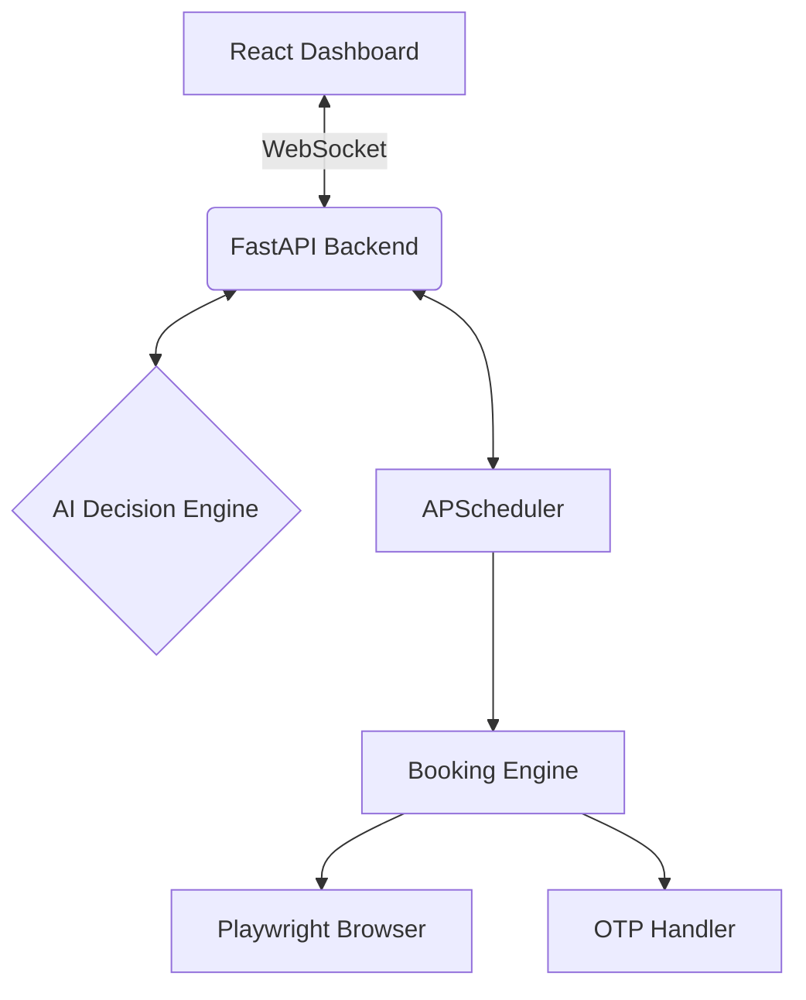

# Texas DPS AI Booking Agent 🤖🚗

[](https://www.python.org/)
[](https://react.dev/)
[](https://fastapi.tiangolo.com/)
[](https://playwright.dev/)

An intelligent, full-stack AI agent that autonomously monitors and books Texas DPS driver license appointments. Features a modern React dashboard, AI-powered decision engine, and real-time WebSocket status updates.


*(Note: Screenshot placeholder)*

## ✨ Key Features

- **🧠 AI Decision Engine**: Automatically determines the correct service type based on your profile (Renew, Replace, First-Time, Permit, etc.).
- **⚡ Real-Time Dashboard**: Monitor the agent's activity live via WebSocket connection.
- **📅 Smart Scheduler**: Prioritizes same-day/next-day slots and handles booking criteria (max distance, location preference).
- **🤖 Automated Booking**: Handles navigation, form filling, and slot selection.
- **📧 OTP Integration**: Fetches OTP codes from your email (Gmail) to complete verification (Best Effort).
- **📱 Mobile Friendly**: Responsive design for checking status on the go.

## 🏗️ Architecture

The system is built as a modular full-stack application:



## 🚀 Quick Start

### Prerequisites

- **Python 3.11+**
- **Node.js 18+** & **npm**
- **Gmail Account** with [App Password](https://support.google.com/accounts/answer/185833) (for OTP & Notifications)

### 1. Clone & Setup Backend

```bash
git clone https://github.com/yourusername/dps-monitor.git
cd dps-monitor

# Create virtual environment
python -m venv venv
.\venv\Scripts\activate  # Windows
# source venv/bin/activate # Mac/Linux

# Install Python dependencies
pip install -r requirements.txt
playwright install chromium
```

### 2. Configure Environment

Create a `.env` file in the root directory:

```ini
# .env
NOTIFY_EMAIL=your_email@gmail.com
SMTP_SERVER=smtp.gmail.com
SMTP_PORT=587
SMTP_USER=your_email@gmail.com
SMTP_PASSWORD=your_app_password_here
```

### 3. Setup Frontend

```bash
cd frontend
npm install
```

### 4. Run the Application

**Terminal 1: Backend API**
```bash
# From root directory (with venv activated)
cd src
uvicorn api.main:app --reload
```
*Backend runs on http://localhost:8000*

**Terminal 2: Frontend Dashboard**
```bash
# From frontend directory
cd frontend
npm run dev
```
*Frontend runs on http://localhost:5173*

## 📖 Usage Guide

1. **Open Dashboard**: Navigate to `http://localhost:5173`.
2. **Onboarding**: Use the wizard to enter your details (Name, DOB, SSN Last 4) and license situation.
3. **AI Analysis**: The agent will analyze your profile and recommend the correct DPS service type.
4. **Start Agent**: Click "Start Monitoring" on the dashboard.
5. **Monitor**: Watch the real-time logs. When an appointment is found:
   - Status changes to `Booking`
   - You receive an email notification
   - **Important**: Be ready to check your email for OTP verification codes if the auto-reader misses it!

## ⚠️ Important Notes

- **OTP Verification**: The system attempts to read OTP from your email. If it fails, you may need to manually intervene.
- **Security**: Your personal data is stored locally in `data/dps_agent.db`. Never commit this file or your `.env` file.
- **Rate Limiting**: The scheduler defaults to checking every 5 minutes to respect DPS server resources.

## 🧪 Running Tests

```bash
# Run all tests
pytest tests/ -v

# Run only AI decision engine tests
pytest tests/test_decision_engine.py -v
```

## 📜 License

MIT License. For personal use only. Use responsibly.
